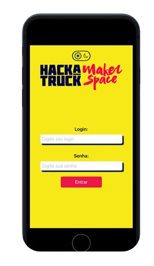
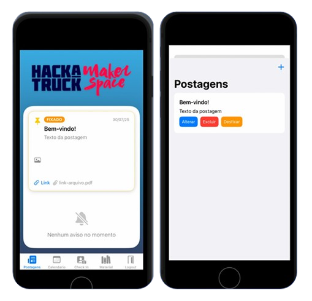
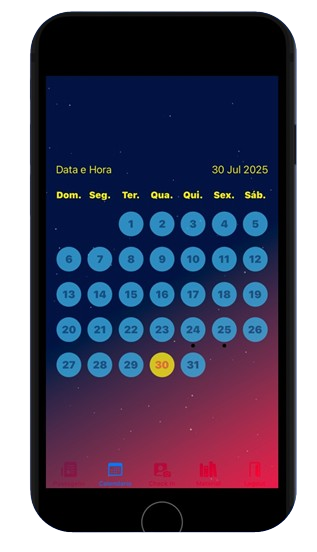
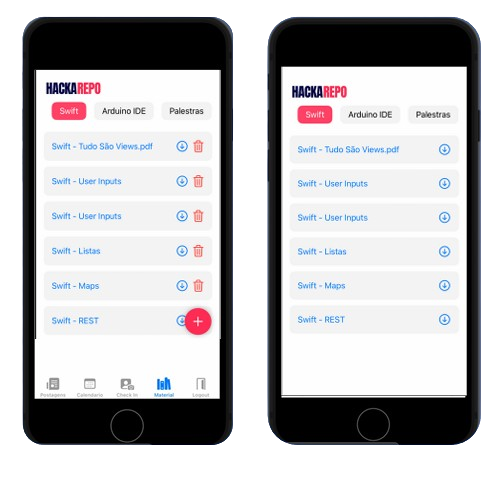
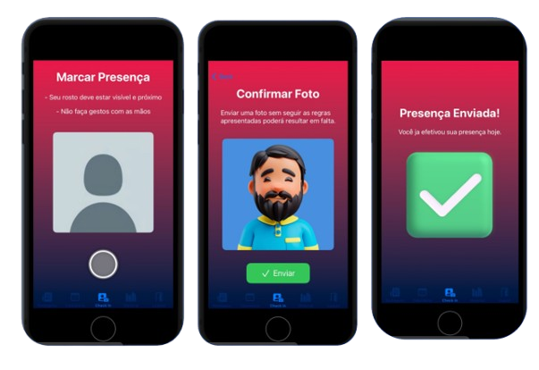
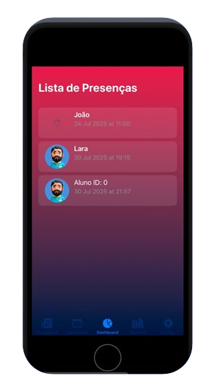
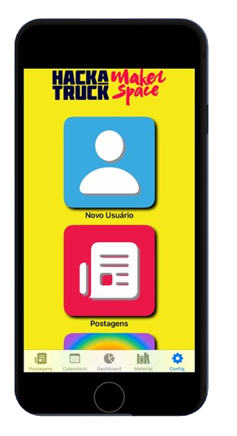
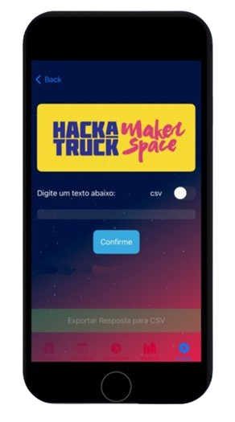

# 🚛 HackaApp - Gestão Inteligente HackaTruck

O **HackaApp** é uma solução mobile completa desenvolvida para otimizar a experiência de alunos e administradores do curso HackaTruck. O aplicativo centraliza materiais de aula, avisos em tempo real e automatiza o processo de chamada através de check-in digital.

## 🚀 Problemas Solucionados
* **Chamada Manual:** Elimina erros e perda de dados com o registro de presença direto pelo app.
* **Descentralização:** Reúne PDFs, calendários e avisos em um único lugar.
* **Gestão Administrativa:** Interface exclusiva para o time gerenciar turmas, conteúdos e dashboards de presença.

## ✨ Funcionalidades Principais

### Para o Aluno 🎓
* **Chamada Digital:** Registro de presença rápido com validação de imagem.
* **Materiais de Aula:** Acesso direto a PDFs e conteúdos organizados.
* **Calendário Integrado:** Visualização de datas, horários e temas das aulas.
* **Central de Avisos:** Comunicação em tempo real com mensagens fixadas.

### Para o Administrador 🛠️
* **Dashboard de Controle:** Gestão total de materiais e calendário.
* **Controle de Presença:** Acompanhamento em tempo real dos check-ins realizados.
* **Gestão de Conteúdo:** Capacidade de postar, editar e excluir avisos e aulas.
* **Gemini para relatórios:** Inteligência Artificial generativa alimentada pelos dados do Aplicativo capaz de gerar Relatórios CSV

## 📱 Interface do Usuário

Aqui você pode ver as principais telas do sistema, desde o login seguro até o controle de check-in.

  
  
  
  
  
  
  
  

## 🔧 Como Rodar o Projeto

Para testar o **HackaApp** localmente:

1. Clone o repositório: 
   `git clone https://github.com/SEU_USUARIO/HackaAppOfc.git`
2. Certifique-se de ter o **Xcode 15+** instalado.
3. Abra o arquivo `HackaAppOfc.xcodeproj`.
4. Selecione um simulador (ex: iPhone 15) e pressione `Cmd + R`.

## 🛠️ Arquitetura do Projeto

O projeto utiliza uma arquitetura moderna integrando o frontend nativo com serviços em nuvem:

| Camada | Tecnologia |
| :--- | :--- |
| **Mobile** | SwiftUI (iOS Nativo) |
| **Backend** | Node-RED (IBM Cloud) |
| **Banco de Dados** | IBM Cloudant (NoSQL) |
| **Comunicação** | API REST / JSON |

## 👥 Desenvolvedores (The Tea PP)
* Arthur Orosco
* Caio Emerick
* Guilherme Guimarães
* Lucas Peres
* Walter Pinhal

---
Desenvolvido como projeto de apoio às atividades do **HackaTruck Maker Space**.
